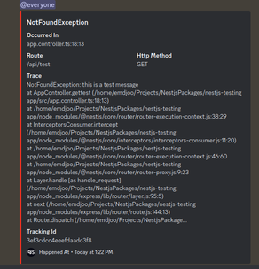

[//]: # (TODO update readme)
## Examples
| Discord                                    | Email                |
|--------------------------------------------|----------------------|
|  | not implemented  yet |

## Description

[Watchman](https://github.com/devcodenix/nest-watchman) is an error cather for Nest framework.

## Installation

```bash
$ npm install @devcodenix/nest-watchman
```
## Usage
#### in ExceptionFilter 
```ts
// all-exception-filter.ts 
constructor(private watchManService: WatchmanService) {
  super();
}
 public catch(exception: IException, host: ArgumentsHost): void {
  this.watchManService.watch(exception,{
    host,
    metaData:{},
    trackUUID:'uuid'
  });
  ...
}
```
- `host` 
  - `host` object exist in exception filter. we get the express `request` and `response` from this object
- `metaData`
  - you can pass anything in this field, but it doesn't any effect on default message. you can access to this data in custom strategy through `super.metaData`
- `trackUUID`
  - if you want to have an uuid to track your errors. note that you can pass uuid in your exception object we have this interface for this purpose `IException` 
#### where ever you want
```ts
this.watchManService.watch(exception,{
  metaData:{},
  trackUUID:'uuid'
});
```
_you don't need to pass `host` here_
## Module Configuration
### Main config properties
- `strategy`
    - you can use the [ default strategies ](#strategies) that provided by us, it has default message structure, and you don't have to do anything about it, or you can use a [custom strategy](#custom-strategy)
- `catchOnlyInternalExceptions`
    - if you pass `true` Watchman will catch only the internal server errors. `default=false`
- `strategyConfig`
    - it will change base on your strategy
### forRoot Config
```ts
// app.module.ts
@Module({
  imports: [
    WatchmanModule.forRoot({
          strategy: DiscordBaseStrategy,
          catchOnlyInternalExceptions: true,
          strategyConfig: {
            webHookUrl: 'https://discord.com/api/webhooks/id/token',
            mentionList: ['everyone'],
          },
    }),
  ],
})
```
### Async Config
#### Using `useFactory` method
```ts
// app.module.ts
@Module({
  imports: [
    WatchmanModule.forRootAsync({
      imports:[AppConfigModule],
      useFactory: (configService: AppConfigService) => {
        return {
          strategy: DiscordBaseStrategy,
          catchOnlyInternalExceptions: true,
          strategyConfig: {
            webHookUrl: configService.WATCHMAN_WEBHOOK,
            mentionList: ['everyone'],
          },
        };
      },
      inject: [AppConfigService],
    }),
  ],
})
```
#### Using `useClass` method
```ts
// app.module.ts
@Module({
  imports: [
    WatchmanModule.forRootAsync({
      imports:[DiscordConfigModule],
      useClass: DiscordConfigService
    }),
  ],
})

// discord.config.service.ts
@Injectable()
export class DiscordConfigService implements WatchmanModuleFactory{
  constructor(private configService: ConfigService) {}
  get WATCHMAN_WEBHOOK(): string {
    return this.configService.get<string>('App.WATCHMAN_WEBHOOK');
  }
  createWatchmanModuleOptions(): Promise<WatchmanModuleOptions> | WatchmanModuleOptions {
    return {
      strategy: DiscordBaseStrategy,
      catchOnlyInternalExceptions: false,
      strategyConfig: {
        webHookUrl: this.WATCHMAN_WEBHOOK,
        mentionList: ['everyone'],
      }
    }
  }
}
```
you can implement your config service class from `WatchmanModuleFactory` interface


## Custom Strategy
```ts
// discord.strategy.ts
@Injectable()
export class DiscordStrategy extends DiscordBaseStrategy {
  constructor(private configService: AppConfigService) {
    super({
      webHookUrl: configService.WATCHMAN_WEBHOOK,
      mentionList: ["here"]
    });
  }
  withMetaDataMessageFormat(): IDiscordBody {
    return super.withMetaDataMessageFormat();
  }
  simpleMessageFormat(): IDiscordBody {
    return super.simpleMessageFormat();
  }
}
```

## Strategies
### Discord

these are the configs that you should pass in `strategyConfig` property or in custom strategy's constructor
```ts
{
  webHookUrl: configService.WATCHMAN_WEBHOOK,
  mentionList: ['everyone']
}
```
- `webHookUrl`
  - discord web hook url. you can find it [here](https://support.discord.com/hc/en-us/articles/228383668-Intro-to-Webhooks)
- `mentionList`
  - list of persons that you want to mention in the discord channel. example `here, everyone`
    - note that don't use @ in the mentions.  
    -  to mention a person you need to pass user id or role id. [Where can I find my User OR Role ID](https://support.discord.com/hc/en-us/articles/206346498-Where-can-I-find-my-User-Server-Message-ID-) 
### Slack
in development process
### Email
in development process
### Microsoft Teams
in development process


## Stay in touch

- Author - [Em Daneshjoo]()

## License

Watchman is [MIT licensed](LICENSE).
